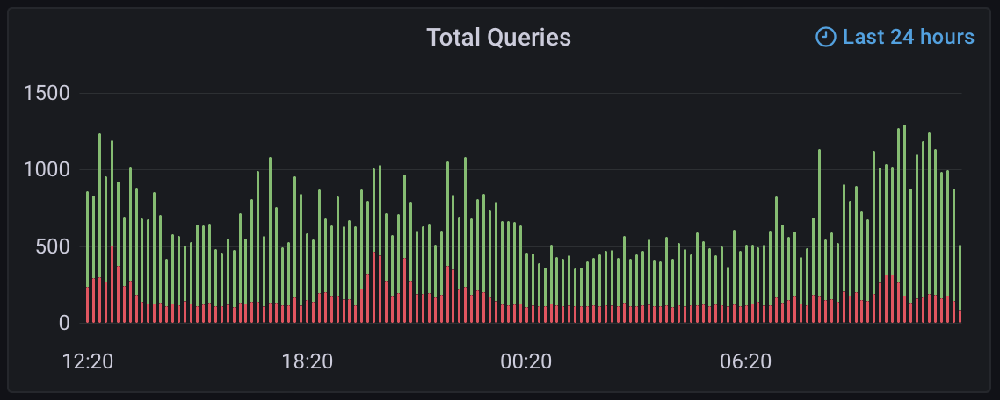

# Pi-hole InfluxDB

Export Pi-hole statistics to InfluxDB 2.x.

## Environment Variables

| Name | Description | Default |
| ---- | ----------- | ------- |
| `INTERVAL_SECONDS` | Interval (in seconds) between polling | `60` |
| `PIHOLE_ALIAS` | Comma-separated list of aliases for the Pi-hole instances | `pihole` |
| `PIHOLE_ADDRESS` | Comma-separated list of Pi-hole adddresses to poll | `http://pi.hole:80` |
| `INFLUXDB_ADDRESS` | Address of the InfluxDB instance | `http://influxdb:8086` |
| `INFLUXDB_ORG` | InfluxDB organization | `my-org` |
| `INFLUXDB_TOKEN` | InfluxDB auth token |  |
| `INFLUXDB_BUCKET` | InfluxDB bucket for storing the data | `pihole` |
| `INFLUXDB_VERIFY_SSL` | Whether or not to verify the InfluxDB SSL certificate (only applicable when using an HTTPS address) | `True` |

## Docker

```bash
docker run -d \
    -e PIHOLE_ALIAS="pihole" \
    -e PIHOLE_ADDRESS="http://pi.hole" \
    -e INFLUXDB_ADDRESS="http://influxdb:8086" \
    -e INFLUXDB_ORG="my-org" \
    -e INFLUXDB_TOKEN="super_secret_token" \
    -e INFLUXDB_BUCKET="pihole" \
    avojak/pihole-influxdb:latest
```

## Docker Compose

```yaml
version: "3.9"
services:
  pihole-influxdb:
    image: avojak/pihole-influxdb:latest
    container_name: pihole-influxdb
    restart: unless-stopped
    environment:
      - "PIHOLE_ALIAS=pihole"
      - "PIHOLE_ADDRESS=http://pi.hole"
      - "INFLUXDB_ADDRESS=http://influxdb:8086"
      - "INFLUXDB_ORG=my-org"
      - "INFLUXDB_TOKEN=super_secret_token"
      - "INFLUXDB_BUCKET=pihole"
```

## Command Line

```bash
python3 pihole-influxdb.py \
    --pihole-aliases "pihole" \
    --pihole-addresses "http://pi.hole" \
    --influxdb-address "http://influxdb:8096" \
    --influxdb-org "my-org" \
    --influxdb-token "super_secret_token" \
    --influxdb-bucket "pihole"
```

## Screenshots

Plotting queries over time in Grafana:

