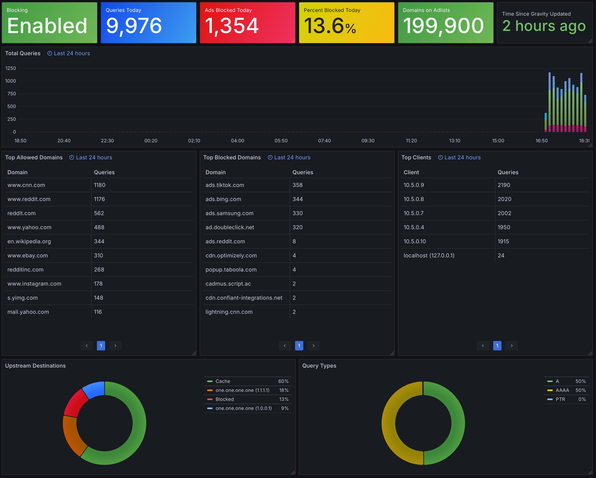

# Pi-hole InfluxDB Monitor

Export Pi-hole statistics to InfluxDB 2.x.

## Pi-hole Compatibility

> [!IMPORTANT]  
> Due to a change in the Pi-hole API, only Pi-hole version 6 will be supported with the latest 2.x releases of the Pi-hole InfluxDB monitor.

| Pi-hole Version | Pi-hole Influx DB Monitor Version |
| --------------- | --------------------------------- |
| `5.x`           | `1.x`                             |
| `6.x`           | `2.x`                             |

## Upgrading to 2.x

Upgrading to version 2.x is a non-passive update.

> [!CAUTION]
> The underlying structure of the data stored in the InfluxDB bucket has changed with version 2.x. As a result, it's recommended to create a
> new bucket.

### Changes to Environment Variables

| `1.x` Environment Variable | `2.x` Equivalent |
| -------------------------- | ---------------- |
| `PIHOLE_TOKEN` | `PIHOLE_PASSWORD` |

### Changes to Measurements and Fields

| `1.x` Measurement | `2.x` Equivalent |
| ----------------- | ----------------- |
| `replies` | `query_replies` |
| `top_queries` | `top_permitted_domains` |
| `top_ads` | `top_blocked_domains` |
| `top_sources` | `top_clients` |
| `forward_destinations` | `upstreams` |
| `status` | `blocking` | 
| `ads_over_time` and `domains_over_time` | `history` |

## Configuration

The application can be configured by providing either environment variables, or CLI options.

> [!NOTE]
> It is recommended to use an application password rather than using the admin password. One application password can be generated from the web
> interface on the settings page (https://docs.pi-hole.net/api/auth/).

### Environment Variables

| Environment Variable | CLI Option | Description | Default |
| -------------------- | ---------- | ----------- | ------- |
| `INTERVAL_SECONDS` | `-i`, `--interval` | Interval (in seconds) between polling | `60` |
| `PIHOLE_ALIAS` | `--pihole-alias` | Comma-separated list of aliases for the Pi-hole instances | `pihole` |
| `PIHOLE_ADDRESS` | `--pihole-address` | Comma-separated list of Pi-hole adddresses to poll | `http://pi.hole:80` |
| `PIHOLE_PASSWORD` | `--pihole-password` | Comma-separated list of Pi-hole API passwords* |  |
| `PIHOLE_NUM_TOP_ITEMS` | `--pihole-num-top-items` | Number of top domains and ads to return | `10` |
| `PIHOLE_NUM_TOP_CLIENTS` | `--pihole-num-top-clients` | Number of top clients to return | `10` |
| `INFLUXDB_ADDRESS` | `--influxdb-address` | Address of the InfluxDB instance | `http://influxdb:8086` |
| `INFLUXDB_ORG` | `--influxdb-org` | InfluxDB organization | `my-org` |
| `INFLUXDB_TOKEN` | `--influxdb-token` | InfluxDB auth token |  |
| `INFLUXDB_BUCKET` | `--influxdb-bucket` | InfluxDB bucket for storing the data | `pihole` |
| `INFLUXDB_CREATE_BUCKET` | `--influxdb-create-bucket` | Whether or not to create the InfluxDB bucket if it does not already exist | `False` |
| `INFLUXDB_VERIFY_SSL` | `--influxdb-skip-verify-ssl` | Whether or not to verify the InfluxDB SSL certificate (only applicable when using an HTTPS address) | Environment variable: `True`, CLI Option: `false` |

\* *Note: required for most, but not all, API endpoints*

## Example Usage

### Docker

```bash
docker run -d \
    -e PIHOLE_ALIAS="pihole" \
    -e PIHOLE_ADDRESS="http://pi.hole" \
    -e PIHOLE_PASSWORD="pihole_password" \
    -e PIHOLE_NUM_TOP_ITEMS=25 \
    -e PIHOLE_NUM_TOP_CLIENTS=25 \
    -e INFLUXDB_ADDRESS="http://influxdb:8086" \
    -e INFLUXDB_ORG="my-org" \
    -e INFLUXDB_TOKEN="super_secret_token" \
    -e INFLUXDB_BUCKET="pihole" \
    avojak/pihole-influxdb:latest
```

### Docker Compose

```yaml
version: "3.9"
services:
  pihole-influxdb:
    image: avojak/pihole-influxdb:latest
    container_name: pihole-influxdb
    restart: unless-stopped
    environment:
      - "PIHOLE_ALIAS=pihole"
      - "PIHOLE_ADDRESS=http://pi.hole"
      - "PIHOLE_PASSWORD=pihole_password"
      - "PIHOLE_NUM_TOP_ITEMS=25"
      - "PIHOLE_NUM_TOP_CLIENTS=25"
      - "INFLUXDB_ADDRESS=http://influxdb:8086"
      - "INFLUXDB_ORG=my-org"
      - "INFLUXDB_TOKEN=super_secret_token"
      - "INFLUXDB_BUCKET=pihole"
```

### Command Line

```bash
python3 pihole_influxdb.py \
    --pihole-alias "pihole" \
    --pihole-address "http://pi.hole" \
    --pihole-password "pihole_password" \
    --pihole-num-top-items 25 \
    --pihole-num-top-clients 25 \
    --influxdb-address "http://influxdb:8096" \
    --influxdb-org "my-org" \
    --influxdb-token "super_secret_token" \
    --influxdb-bucket "pihole"
```

## Screenshots

Simple dashboard in Grafana (See: [grafana/Pi-hole.json](grafana/Pi-hole.json)):



## References

Rough API documentation for the Pi-hole API is available here: https://ftl.pi-hole.net/master/docs/ (or the `/api/docs` endpoint of a running Pi-hole instance)